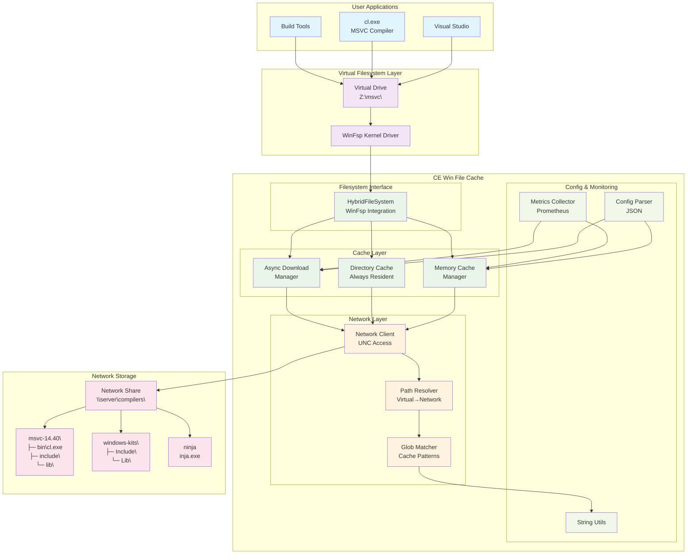
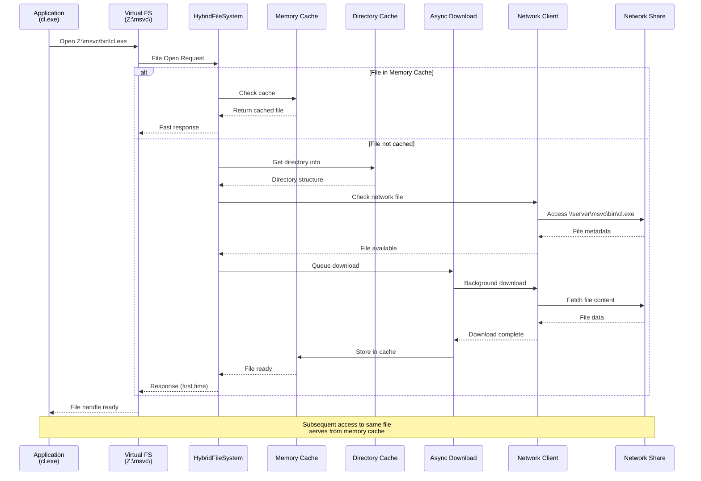
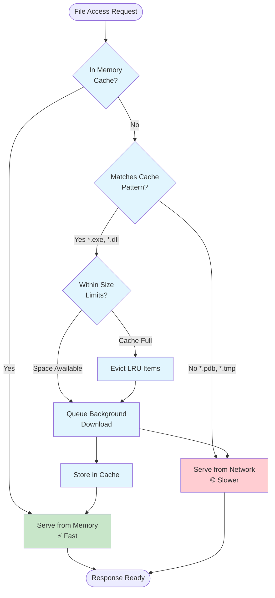

# CE Win File Cache - Architecture Overview

## What is CE Win File Cache?

**CE Win File Cache** is a high-performance caching filesystem for Windows that accelerates access to compiler toolchains and development tools stored on network shares. It's specifically designed for distributed development teams where build tools are centrally hosted but local access needs to be fast.

## Problem It Solves

```
❌ BEFORE: Slow Network Access
Developer's Machine          Network Share
┌─────────────────┐          ┌─────────────────┐
│   Build Process │◄────────►│ \\server\msvc\  │
│                 │   Slow   │   ├─ bin/       │
│ - Compiling...  │ Network  │   ├─ include/   │
│ - Linking...    │ Latency  │   └─ lib/       │
│ - Waiting...    │          │                 │
└─────────────────┘          └─────────────────┘

✅ AFTER: Fast Cached Access  
Developer's Machine                    Network Share
┌─────────────────┐    ┌─────────────┐ ┌─────────────────┐
│   Build Process │◄──►│ File Cache  │◄│ \\server\msvc\  │
│                 │Fast│ Filesystem  │ │   ├─ bin/       │
│ - Compiling ✓   │    │             │ │   ├─ include/   │
│ - Linking ✓     │    │ ├─ Memory   │ │   └─ lib/       │
│ - Done!         │    │ ├─ Disk     │ │                 │
└─────────────────┘    │ └─ Async    │ └─────────────────┘
                       └─────────────┘
```

## Architecture Diagram



### Data Flow Diagram



### Cache Policy Flow



## Key Features

### 🚀 **Multi-Layer Caching**
- **Memory Cache**: Ultra-fast access for frequently used files
- **Directory Cache**: Always-cached directory structures for instant browsing
- **Disk Cache**: Persistent storage with LRU eviction

### ⚡ **Async Operations**
- Background downloads don't block file access
- Thread pool for concurrent network operations
- Non-blocking cache warming

### 🎯 **Smart Cache Policies**
- **Pattern-based**: Cache `*.exe`, `*.dll` but not `*.pdb`
- **Size-aware**: Different limits per compiler
- **Access-based**: LRU eviction keeps hot files in memory

### 📊 **Monitoring & Observability**
- Prometheus metrics for cache performance
- Hit/miss ratios, download speeds, queue depths
- Health monitoring for distributed teams

## Configuration Example

```json
{
  "global": {
    "total_cache_size_mb": 4096,
    "eviction_policy": "lru",
    "cache_directory": "./cache",
    "download_threads": 8
  },
  "compilers": {
    "msvc-14.40": {
      "network_path": "\\\\build-server\\msvc\\14.40",
      "cache_size_mb": 2048,
      "cache_always": ["*.exe", "*.dll", "*.lib"],
      "cache_never": ["*.pdb", "*.ilk"],
      "prefetch_patterns": ["bin/**/*.exe", "include/**/*.h"]
    },
    "windows-kits-10": {
      "network_path": "\\\\build-server\\kits\\10",
      "cache_size_mb": 1024,
      "cache_always": ["*.lib", "*.h"],
      "prefetch_patterns": ["Include/**/*.h", "Lib/**/*.lib"]
    }
  }
}
```

## Use Cases

### 🏢 **Enterprise Development**
- Central build servers with compiler toolchains
- Remote developers with slow network connections
- CI/CD pipelines needing fast tool access

### 🌐 **Distributed Teams**
- Geographically distributed development teams
- Consistent toolchain versions across locations
- Reduced bandwidth usage through intelligent caching

### 🔄 **Build Performance**
- Faster compilation times
- Reduced network latency for file access
- Improved developer productivity

## Performance Benefits

The caching system provides significant performance improvements by:

- **Memory cache hits**: Serve frequently accessed files directly from RAM
- **Directory structure caching**: Eliminate network round-trips for directory listings
- **Background downloads**: Async fetching doesn't block file access
- **Pattern-based caching**: Focus cache space on high-impact files (executables, libraries)
- **LRU eviction**: Keep most-used files readily available

## Technical Highlights

- **WinFsp Integration**: Kernel-level filesystem driver for transparency
- **Cross-Platform Testing**: Linux CI for core logic, Windows for full stack
- **Modern C++20**: Clean, maintainable codebase with strong typing
- **Comprehensive Testing**: Unit tests, integration tests, performance benchmarks
- **Production Ready**: Metrics, logging, error handling, graceful degradation

---

*CE Win File Cache transforms slow network-based development workflows into fast, responsive local experiences while maintaining the benefits of centralized tool management.*